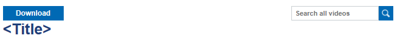

# ETH-Extensions

## About
This extension allows you to average your transcript directly in MyStudies and download lectures from the ETH video portal.

## Usage
1) Download zip [here](https://github.com/zzuro/eth-extensions/releases/tag/2.0.1v) and unzip
2) Open extension menu in your browser
3) Enable Developer mode
4) press Load unzipped files
5) select the unzipped folder of the downloaded extension
6) open your transcript, you should see:

7) open a lecture on the ETH video portal, you should see:

   

